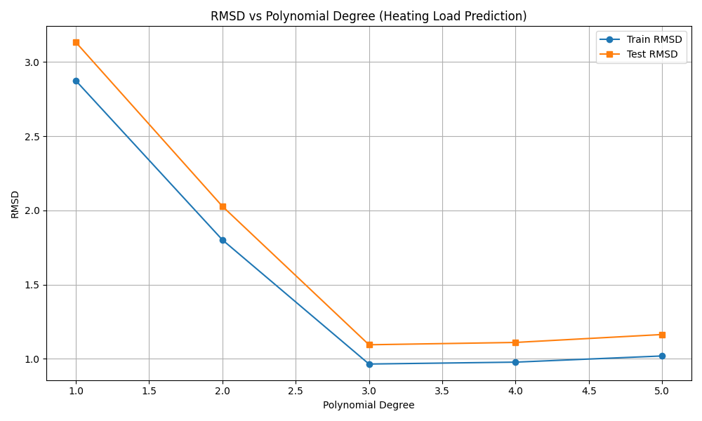

# regression-on-energy-efficiency

# Heating Load Prediction using Polynomial Regression

This project applies polynomial regression to predict the heating load of buildings based on various architectural features.

The model evaluates polynomial degrees from 1 to 5 and compares the RMSD on both training and testing datasets. This helps assess the model's performance and potential overfitting as the complexity increases.

## Dataset

The dataset used is `energy_efficiency_data.csv`.

## Plot: RMSD vs Polynomial Degree

This plot illustrates the RMSD for training and testing sets as a function of the polynomial degree used for the regression. It serves as a diagnostic tool to determine the most appropriate polynomial degree for this task.
